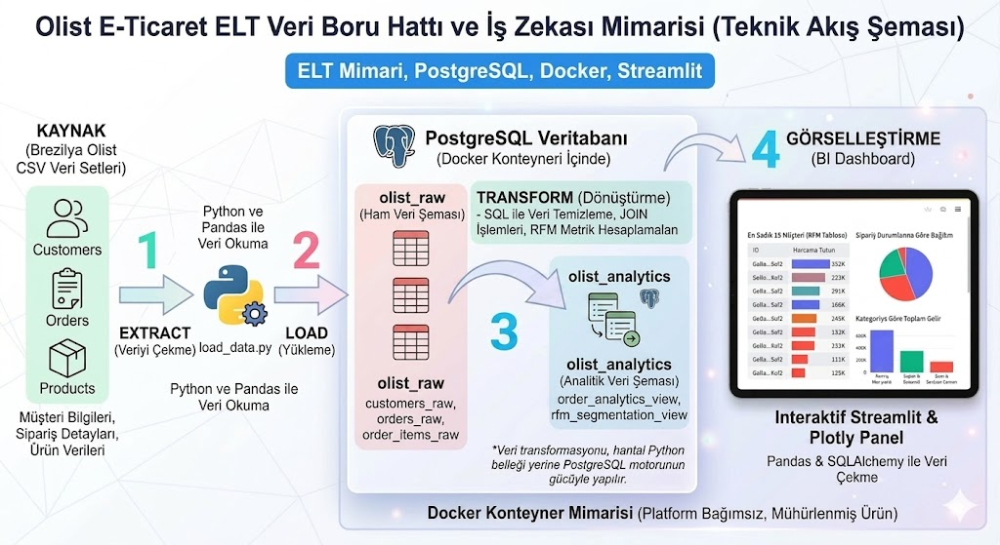

MERHABALAR,

Projenin kurulum gerektirmeden, her bilgisayarda izole ve sorunsuz çalışabilmesi için tüm mimari Docker ile paketlenmiştir. Projeyi çalıştırmak ve arayüze erişmek için lütfen aşağıdaki 3 kısa adımı izleyiniz:

ADIM 1: KLASÖRE GİRİŞ
Bu dizinde bulunan "e_commerce_elt" isimli klasörün içine giriniz. (Kodların ve Docker dosyalarının olduğu klasör).

ADIM 2: SİSTEMİ AYAĞA KALDIRMA
"e_commerce_elt" klasörünün içindeyken bir Terminal (Mac) veya Komut Satırı / PowerShell (Windows) penceresi açıp aşağıdaki komutu kopyalayıp çalıştırınız:

docker-compose up --build -d

(Not: Bu komut veritabanını, ELT şemalarını ve Streamlit arayüzünü otomatik olarak kurup başlatacaktır. Bilgisayarınızda Docker Desktop uygulamasının açık ve çalışır durumda olduğundan emin olunuz.)

ADIM 3: ARAYÜZÜ GÖRÜNTÜLEME
Terminalde yeşil "Started" yazılarını gördükten saniyeler sonra, dilediğiniz bir web tarayıcısını (Chrome, Safari vb.) açıp adres çubuğuna şunu yazınız:

localhost:8501

İş Zekâsı (BI) panelimiz karşınızda olacaktır. Detaylı teknik akış ve mimari savunması için klasördeki PDF raporunu inceleyebilirsiniz.

Saygılarımla.
